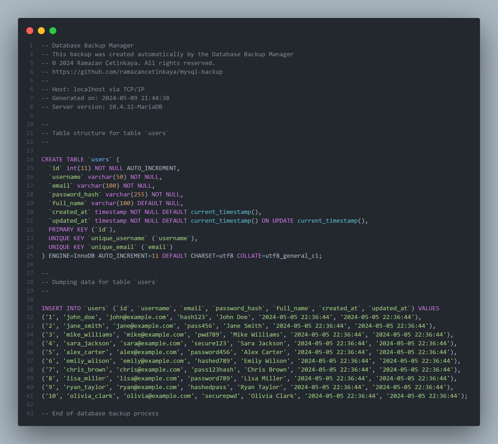

<h1 align="center">MySQL Backup & Restore Library</h1>

[](https://github.com/ramazancetinkaya/mysql-backup/blob/master/LICENSE)
[](https://github.com/ramazancetinkaya/mysql-backup/issues)
[](https://github.com/ramazancetinkaya/mysql-backup/stargazers)
[](https://github.com/ramazancetinkaya/mysql-backup/network)

<p align="center">
  <a href="https://github.com/ramazancetinkaya/mysql-backup">
    
  </a>

  <h3 align="center">MySQL Backup & Restore Library</h3>

  <p align="center">
    A powerful and modern PHP library for backing up and restoring MySQL databases using PDO.
    <br>
    <a href="https://github.com/ramazancetinkaya/mysql-backup/blob/main/README.md"><strong>Explore the docs »</strong></a>
    <br>
    <br>
    <a href="https://github.com/ramazancetinkaya/mysql-backup/issues">Report a Bug</a>
    ·
    <a href="https://github.com/ramazancetinkaya/mysql-backup/pulls">New Pull Request</a>
  </p>
</p>

<br>

## 🌟 Star this Repository!

If you find the MySQL Backup & Restore library helpful or interesting, consider giving it a star! ⭐️

Your star helps us grow and motivates us to continue improving the library. It also makes it easier for others to discover and benefit from this project.

### How to Star?

1. **Login to Your GitHub Account:** You need to have a GitHub account.
2. **Visit the Repository:** Go to the [MySQL Backup & Restore Repository](https://github.com/ramazancetinkaya/mysql-backup).
3. **Click the Star Button:** On the top-right corner of the page, you'll find a "Star" button. Click on it!

That's it! Thank you for your support! 🚀

## Table of Contents

* [Introduction](#introduction)
* [About the Project](#about-the-project)
* [Screenshot](#screenshot)
* [Features](#features)
* [Requirements](#requirements)
* [Installation](#installation)
* [Usage](#usage)
* [Disclaimer](#disclaimer)
* [Contributing](#contributing)
* [Authors](#authors)
* [License](#license)
* [Copyright](#copyright)

## Introduction

This library is meticulously crafted to cater to a wide spectrum of users, ranging from novices venturing into the field to seasoned developers seeking seamless integration and robust functionality.

## About the Project

The MySQL Backup & Restore Library furnishes comprehensive functionalities tailored for the seamless backup and restoration of MySQL databases through PHP. Leveraging this library, developers can effectively safeguard vital data housed within MySQL databases, ensuring robust data integrity and facilitating swift recovery in the event of data loss or system failures.

### Screenshot



## Features

* Backup entire MySQL databases or specific tables.
* Restore databases from backup files.
* Generate SQL dumps in a structured format.
* Automatic generation of backup filenames with date and time.
* Archive backups in ZIP format.
* Send backups via email.
* Easy to integrate into existing PHP projects.

## Requirements

- PHP version 8.0 or **higher**
- PDO extension **enabled**
- ZipArchive extension **enabled**
- PHPMailer
- MySQL database
- Composer (for installation)

## Installation

This library can be easily installed using [Composer](https://getcomposer.org/), a modern PHP dependency manager.

### Step 1: Install Composer

If you don't have Composer installed, you can download and install it by following the instructions on the [official Composer website](https://getcomposer.org/download/).

### Step 2: Install the Library

Once Composer is installed, you can install the `mysql-backup` library by running the following command in your project's root directory:

```bash
composer require ramazancetinkaya/mysql-backup
```

## Usage

```php
require 'vendor/autoload.php'; // Include Composer's autoloader

use DatabaseBackupManager\MySQLBackup;

// Initialize PDO connection
$db = new PDO('mysql:host=localhost;dbname=my_database', 'username', 'password');

// Create an instance of MySQLBackup
$mysqlBackup = new MySQLBackup($db);
```

- Perform a database backup:
```php
// Backs up all tables
$backup = $mysqlBackup->backup();

// Backs up the specified tables
$backup = $mysqlBackup->backup(['tablename1']);
$backup = $mysqlBackup->backup(['tablename1', 'tablename2']);

// Include table data in the backup or vice versa
$backup = $mysqlBackup->backup(true); // Default is true

// Archiving
$backup = $mysqlBackup->backup(true, false); // Default is false

// Send the backup file by email
$backup = $mysqlBackup->backup(true, true, 'recipient@example.com'); // Default is null

if ($backup) {
    echo "Database backup created successfully.";
} else {
    echo "Database backup failed!";
}
```

- Perform a database restore:
```php
// Restore a database
$backupFile = 'backup_wordpress-2024-05-09_214345.sql';
$restore = $mysqlBackup->restore($backupFile);

// Whether to drop existing tables before restoring data
$restore = $mysqlBackup->restore($backupFile, true); // Default is true

if ($restore) {
    echo "Database restored successfully.";
} else {
    echo "Database restoration failed!";
}
```

## Disclaimer

This library is provided as-is without any warranties, expressed or implied. The use of this library is at your own risk, and the developers will not be liable for any damages or losses resulting from its use.

While every effort has been made to ensure the accuracy and reliability of the code in this library, it's important to understand that no guarantee is provided regarding its correctness or suitability for any purpose.

Users are encouraged to review and test the functionality of this library in their own environments before deploying it in production or critical systems.

This disclaimer extends to all parts of the library and its documentation.

**By using the Library, you agree to these terms and conditions. If you do not agree with any part of this disclaimer, do not use the Library.**

---

This disclaimer was last updated on May 9, 2024.

## Contributing

Contributions are welcome! If you find any issues or have suggestions for improvements, feel free to open an issue or create a pull request.

## Authors

- **Ramazan Çetinkaya** - [@ramazancetinkaya](https://github.com/ramazancetinkaya)

## License

This project is licensed under the MIT License. For more details, see the [LICENSE](LICENSE) file.

## Copyright

© 2024 Ramazan Çetinkaya. All rights reserved.
